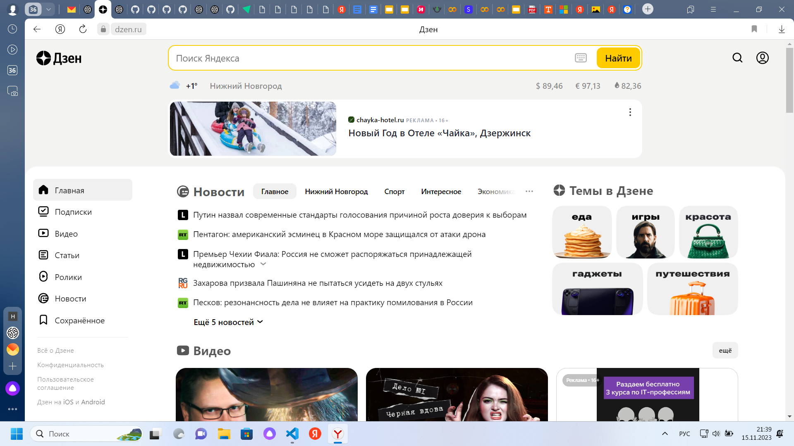
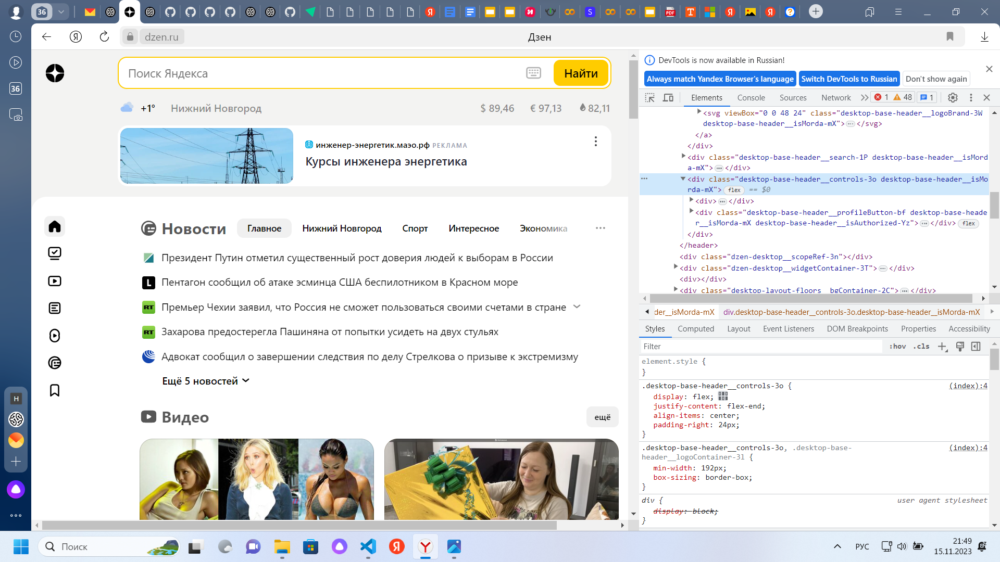
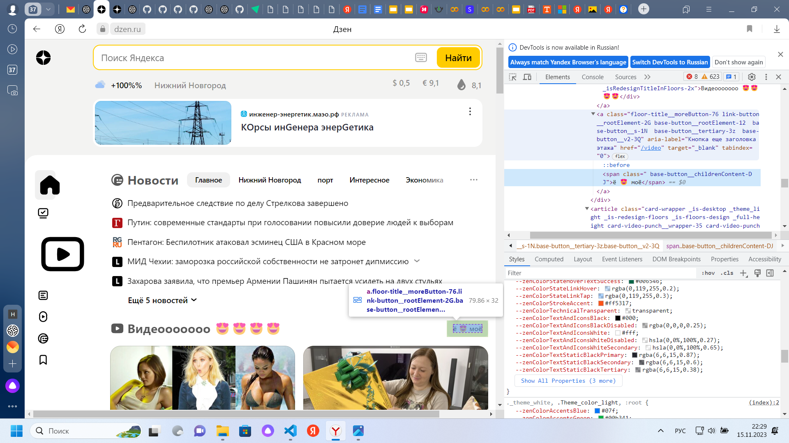
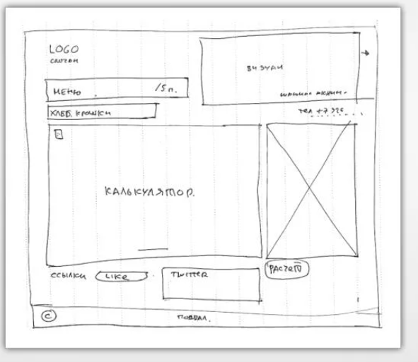

# Задача: на основе сайта yandex.ru:
## - Определите, на каком протоколе работает сайт.

https://dzen.ru/

## - Проанализируйте структуру страницы сайта.

## - Внесите не менее 10 изменений на страницу с помощью инструмента разработчика и представьте скриншоты было:

## стало:

## - Создайте прототип низкой детализации (дополнительное задание, если на семинаре дошли до задания №8).
